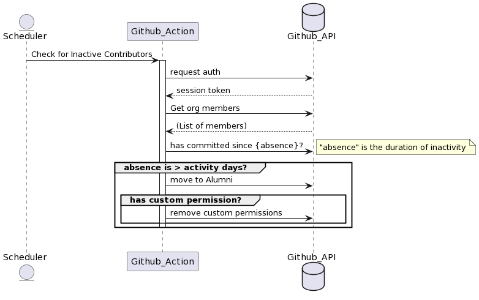

# retire-inactive-contributor README.md

## Now as a Github action

When this Github action runs:
    - It requests a list of all contributors
    - Moves inactive contributors to a less-privileged alumni team 
    - If an inactive contributor has custom permissions, these permissions are revoked



> Previously, a bot built with [Probot](https://github.com/probot/probot) that Retire inactive contributors from one team to another, now done using a GitHub Action

## Setup

The current project code is based on the sample TypeScript action available at https://github.com/actions/typescript-action

If you are using VSCode you can also use the following workspace settings for Prettier/ESLint:

```
{
	"editor.formatOnSave": true,
	"[typescript]": {
		"editor.formatOnSave": false,
		"editor.defaultFormatter": "esbenp.prettier-vscode"
	},
	"editor.codeActionsOnSave": {
		"source.fixAll.eslint": true
	}
}
```

## Contributing

If you have suggestions for how inactive-contributor-bot could be improved, or want to report a bug, open an issue! We'd love all and any contributions.

For more, check out the [Contributing Guide](CONTRIBUTING.md).

## License

[ISC](LICENSE) © 2022 Matt Wynne, Kate Dames, Blaise Pabon <matt@cucumber.io>
